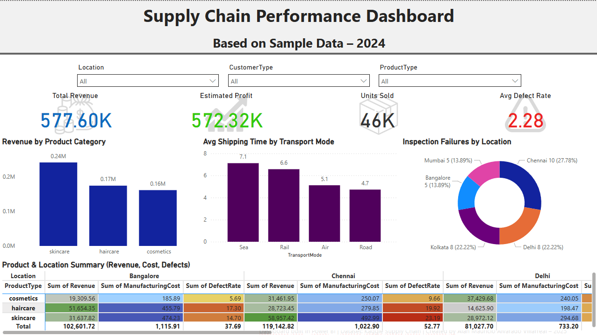

# Powerbi-portfolio
My Power BI Dashboard analyzing supply chain data from Kaggle

# 📦 Supply Chain Performance Dashboard

**📊 Tool Used:** Power BI Desktop  
**📁 Dataset:** [Supply Chain Analysis on Kaggle](https://www.kaggle.com/datasets/harshsingh2209/supply-chain-analysis)  
**📅 Date Created:** May 2025  
**👨‍💻 Created By:** Alan Mauricio Alvarado Villarreal

---

## 🎯 Objective
Design an interactive dashboard to analyze supply chain operations including product revenue, shipping performance, production costs, and quality control across five Indian cities.

---

## 📌 Key Features
- 💰 **KPI Cards**: Total Revenue, Estimated Profit, Units Sold, Defect Rate
- 📊 **Charts**: 
  - Revenue by Product Type
  - Avg Shipping Time by Transport Mode
  - Donut chart for Inspection Failures
- 📋 **Matrix Table**: Product x Location with Revenue, Costs, and Defect Rates
- 🎨 Conditional formatting, custom icons, slicers, and interactive filters

---

## 📈 Key Insights
- **Skincare** generated the highest revenue
- **Sea transport** has the slowest delivery time (avg 7.1 days)
- **Chennai** had the most inspection failures (27.8%)
- Estimated profit was over **572K**, suggesting strong margins

---

## 🖼 Dashboard Preview

---

## 📂 Files
- 📊 `supply_chain_dashboard.pbix`
- 🖼 Dashboard screenshot(s)
- 📄 Optional PDF report

---

## 🔗 Credits
Dataset from Kaggle: [Supply Chain Analysis](https://www.kaggle.com/datasets/harshsingh2209/supply-chain-analysis)  
Dashboard and writeup by Alan Mauricio Alvarado Villarreal
